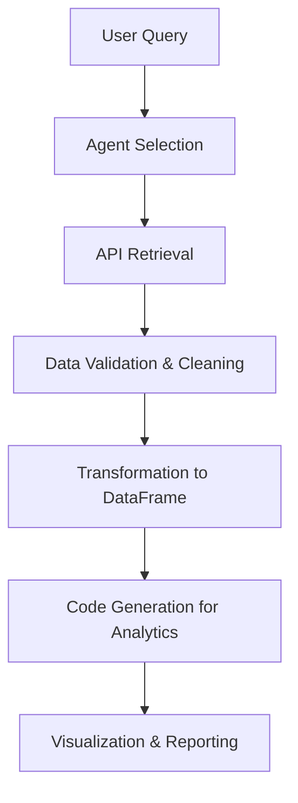

# **Orbit: AI Multi-Agent Query & Data Processing**  

## **🚀 What is Orbit?**  
Orbit is an **AI-powered, multi-agent system** that processes **natural language queries** and generates **structured insights** using APIs, data transformations, and analytics.  

It orchestrates **multiple AI agents** to:  
✅ **Choose the best API endpoint** for a given query (98% accuracy)  
✅ **Transform API data into structured DataFrames** (92% accuracy)  
✅ **Generate analytics & visualizations from data** (90% accuracy)  

At its best, **Orbit automates full-cycle data retrieval, transformation, and analysis.**  

---

## **🔹 What Makes Orbit Powerful?**  

🚀 **Multi-Agent LLM Orchestration** → Uses **custom-built agents + LangChain, Phi-Data, etc.**  
🚀 **Dynamic Query Understanding** → AI selects the best API & processes responses automatically  
🚀 **Cross-Domain Compatibility** → Tested on **F1, finance, government, climate data, and more**  
🚀 **Scalable & Production-Ready** → **Frontend:** Next.js + Vercel, **Backend:** FastAPI + Railway  

---

## **📊 Performance Metrics**  

| **Tested Capability** | **Best Accuracy** | **Failure Cases** |
|----------------------|------------------|------------------|
| Query → Endpoint Selection | **98%** | Hallucination on complex, unrelated queries |
| Query → DataFrame | **92%** | API failures, wrong unique IDs in nested JSON |
| DataFrame → Code Generation | **90%** | Errors in mathematical logic & visual execution |

---

## **🛠️ How Orbit Works**  

1️⃣ **User asks a question** (e.g., "Show me Verstappen’s 2023 podiums")  
2️⃣ **Multi-Agent AI selects the best API endpoint**  
3️⃣ **It fetches, cleans, and transforms the data**  
4️⃣ **Data is converted into tables, visualizations, or analytics**  
5️⃣ **User gets structured insights automatically**  

**Example Query Flow:**  



---

## **📦 Tech Stack**  

✅ **Frontend:** Next.js + ShadCN + Vercel  
✅ **Backend:** FastAPI + Railway  
✅ **Multi-Agent AI:** LangChain, Phi-Data, Custom Agent Framework  
✅ **Data Processing:** Pandas, NumPy, JSON Parsers  
✅ **Visualization:** Matplotlib, Seaborn, Vega-Lite  

---

## **🚀 How to Run Orbit**  

### **1️⃣ Clone the Repository**  
```bash
git clone https://github.com/barat-paim/orbit.git
cd orbit
```

### **2️⃣ Install Dependencies**  
```bash
pip install -r requirements.txt
```

### **3️⃣ Start the Backend**  
```bash
uvicorn app.main:app --reload
```

### **4️⃣ Start the Frontend**  
```bash
cd frontend
npm install
npm run dev
```

---

## **🔮 Future Improvements**  

🔹 **Improve Query-to-DataFrame Matching (Reduce API errors)**  
🔹 **Better Handling of Complex Math for Code Generation**  
🔹 **Deploy Multi-Domain Versions for Finance, Climate, & Government**  
🔹 **Integrate Custom LLM Fine-Tuning for Domain-Specific Queries**  

---

## **📌 Why Orbit Matters?**  

💡 **Imagine asking a question and instantly getting structured, accurate, and visualized answers—without coding, spreadsheets, or API calls.** That’s what **Orbit** does.  

📌 **Ideal for:** Data scientists, AI engineers, research analysts, and decision-makers who need **fast, reliable, AI-powered insights.**  

---

### **💡 Final Takeaway**  
Orbit **automates data-driven decision-making** by orchestrating AI agents for **querying, transforming, and analyzing data—faster than ever before.**  

---
