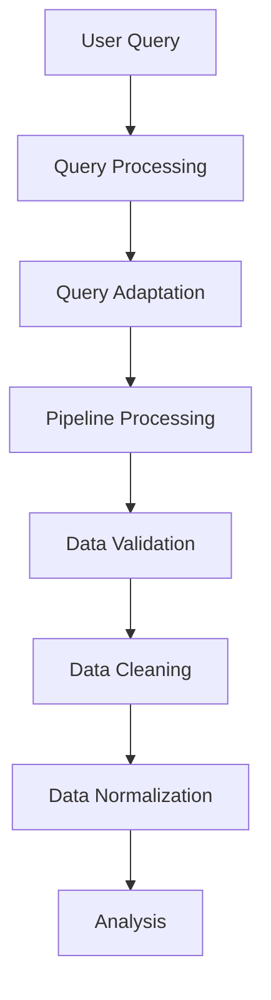
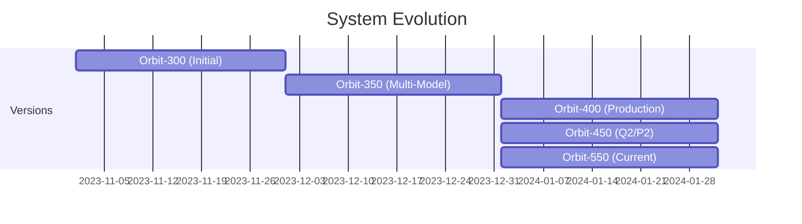
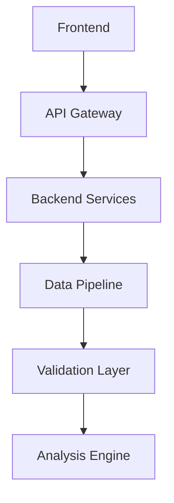

# Orbit VI Architecture Evolution

## Current Version: Orbit-550 (Latest)

### Enhanced Data Processing Architecture
The current version introduces robust data handling and validation with a focus on reliability and debugging capabilities.



### Key Components
1. **Data Validation Layer**
   - `validate_constructor_data`: Handles various data formats
   - `normalize_constructor_data`: Standardizes constructor information
   - `clean_dataframe`: Manages data cleaning and deduplication

2. **Enhanced Processing Flow**
   ```python
   # Five-stage processing pipeline
   query_result = await processor.process_query(query)
   adapted_result = await query_adapter.adapt(query_result)
   pipeline_result = await pipeline.process(requirements)
   cleaned_data = clean_dataframe(results)
   normalized_data = normalize_constructor_data(cleaned_data)
   code = generate_code(normalized_data, query)
   result = execute_code_safely(code)
   ```

3. **Comprehensive Error Handling**
   - Detailed logging at each stage
   - Granular error tracking
   - Type-specific data handling
   - Robust validation checks

### Improvements from Previous Versions
- Added robust data validation and cleaning
- Enhanced error handling and logging
- Improved DataFrame processing
- Better handling of complex data types

## Previous Versions

### Orbit-450: Q2 and P2 Architecture

#### Q2 (Query Quality) System
- Multi-agent query processing
- Enhanced natural language understanding
- Pattern-based caching
- Confidence scoring

#### P2 (Pipeline Performance) System
- Parallel data processing
- Optimized adapters
- Two-level caching
- Enhanced error recovery

### Orbit-400: Production Architecture
- Distributed system deployment
- Vercel frontend deployment
- Railway backend hosting
- PostgreSQL database integration
- Comprehensive security measures

### Orbit-350: Multi-Model System
- Multi-model orchestration
- Follow-up query handling
- Context-aware processing
- Real-time visualization
- Advanced state management

### Orbit-300: Initial Design
- Basic pipeline architecture
- Simple query processing
- Time-series analysis focus
- Basic data validation
- Component separation

## Evolution Timeline



## Key Architectural Changes

### Data Processing Evolution
```
Orbit-300: Basic Pipeline → 
Orbit-350: Multi-Model → 
Orbit-400: Distributed → 
Orbit-450: Parallel Processing → 
Orbit-550: Enhanced Validation
```

### Query Processing Evolution
```
Orbit-300: Basic Queries → 
Orbit-350: Context-Aware → 
Orbit-400: Production-Ready → 
Orbit-450: Multi-Agent → 
Orbit-550: Robust Validation
```

### Error Handling Evolution
```
Orbit-300: Basic Errors → 
Orbit-350: Model-Specific → 
Orbit-400: Production Logging → 
Orbit-450: Recovery Strategies → 
Orbit-550: Comprehensive Tracking
```

## System Integration Points

### Current Integration (Orbit-550)


### Key Features Across Versions

#### Orbit-550 (Current)
- Enhanced data validation
- Robust error handling
- Comprehensive logging
- Type-safe processing

#### Orbit-450
- Multi-agent processing
- Parallel data fetching
- Advanced caching
- Performance optimization

#### Orbit-400
- Production deployment
- Security implementation
- Distributed architecture
- Monitoring systems

#### Orbit-350
- Multi-model support
- Context management
- Follow-up handling
- Real-time processing

#### Orbit-300
- Basic pipeline
- Simple validation
- Component separation
- Time-series focus

## Future Considerations

### Planned Enhancements
1. Enhanced caching strategies
2. Advanced error recovery
3. Performance optimization
4. Extended validation rules

### Monitoring and Maintenance
1. Comprehensive logging
2. Performance tracking
3. Error pattern analysis
4. System health monitoring 