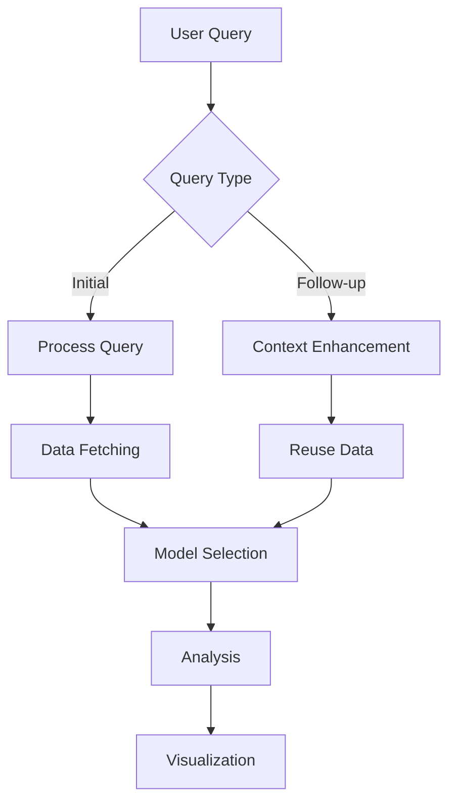

# F1 Analysis System Design

## System Architecture

### Overview
The F1 Analysis System is built on a modern, scalable architecture that combines real-time data processing with advanced AI analysis capabilities. The system uses a microservices-based approach with the following key components:

```
┌─────────────────┐     ┌─────────────────┐     ┌───────────────────────┐
│   Frontend      │     │    Backend      │     │    Model Layer        │
│  (Next.js)      │────▶│   (FastAPI)     │────▶│  (Multi-Model System) │
└─────────────────┘     └─────────────────┘     └───────────────────────┘
        │                       │                          │
        │                       ▼                          ▼
        │                ┌─────────────────┐     ┌─────────────────┐
        │                │   Database      │     │   File Storage  │
        │                │   (SQLite)      │     │   (Local/S3)    │
        └───────────────▶└─────────────────┘     └─────────────────┘
```

### Components

1. **Frontend Layer**
   - Next.js application with React components
   - Interactive query interface with follow-up capability
   - Real-time data visualization
   - Sidebar-based follow-up query system
   - State management for query context

2. **Backend Layer**
   - FastAPI application
   - Multi-model orchestration system
   - Follow-up query processing
   - Data pipeline integration
   - Query history management

3. **Model Layer**
   - Multi-model orchestration
   - GPT-4 for complex analysis
   - Claude for stable code generation
   - Context-aware follow-up handling
   - Model selection based on query type

4. **Data Layer**
   - F1 data pipeline
   - Real-time data processing
   - Data caching and persistence
   - Query result storage

## Key Features

### 1. Multi-Model Orchestration
```python
class ModelOrchestrator:
    def __init__(self):
        self.models = {
            'gpt4': GPT4Assistant(),
            'claude': ClaudeModel(),
            'stable': StableModel()
        }
        
    async def process_query(self, query: str, context: Optional[Dict] = None):
        model = self.select_model(query, context)
        return await model.generate(query, context)
```

### 2. Follow-up Query System
```python
class FollowUpHandler:
    def __init__(self):
        self.context_store = {}
        
    async def process_follow_up(self, query: str, initial_context: Dict):
        # Enhance query with context
        enhanced_query = self.merge_context(query, initial_context)
        return await self.analyze(enhanced_query)
```

### 3. Query Processing Flow


## Implementation Details

### 1. Frontend Components
- Main query interface
- Follow-up query sidebar
- Real-time visualization
- Query history display
- Context management

### 2. Backend Services
- Query processing
- Data pipeline
- Model orchestration
- Follow-up handling
- Result caching

### 3. Model Integration
- GPT-4 for complex analysis
- Claude for code generation
- Context-aware processing
- Model selection logic
- Error handling

### 4. Data Management
- Query context storage
- Result caching
- Data normalization
- History tracking
- Performance optimization

## API Endpoints

### 1. Query Processing
```http
POST /api/v1/process_query
Content-Type: application/json
{
    "query": "string",
    "context": "object?"
}
```

### 2. Follow-up Queries
```http
POST /api/v1/analyze_data
Content-Type: application/json
{
    "query": "string",
    "data": "object",
    "requirements": {
        "endpoint": "/api/f1/follow-up",
        "params": {}
    }
}
```

## Security Considerations

1. **Query Validation**
   - Input sanitization
   - Query length limits
   - Rate limiting
   - Context validation

2. **Model Access**
   - API key management
   - Request quotas
   - Error handling
   - Fallback mechanisms

3. **Data Protection**
   - Query history encryption
   - Context data security
   - Result caching policies
   - Access control

## Future Enhancements

1. **Model Improvements**
   - Additional model integration
   - Performance optimization
   - Context handling enhancement
   - Error recovery

2. **UI/UX Enhancements**
   - Advanced visualization
   - Interactive follow-ups
   - Context visualization
   - Query suggestions

3. **Backend Optimization**
   - Caching improvements
   - Query optimization
   - Model selection refinement
   - Context management 