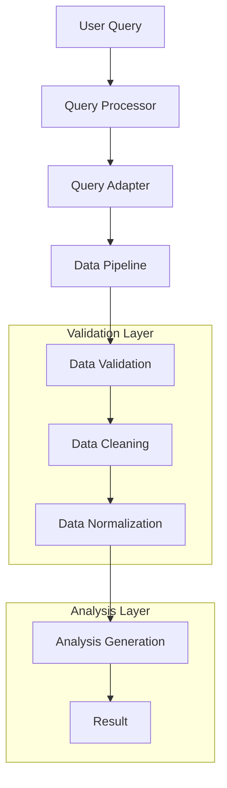

# Data Pipeline Flows

## Query Processing Flow



## Data Transformation Rules

### 1. Query Processing
```python
# Input: Natural language query
# Output: DataRequirements
{
    'endpoint': '/api/f1/constructors',
    'params': {
        'constructor': 'ferrari',
        'season': ['2015', '2016', '2017']
    }
}
```

### 2. Data Validation
```python
# Input: Raw constructor data
# Output: Validated data
def validate_constructor_data(data: Any) -> List[Dict]:
    """
    Validation steps:
    1. Parse string data (JSON/literal)
    2. Ensure list format
    3. Validate required fields
    4. Check data types
    """
```

### 3. Data Cleaning
```python
# Input: Validated data
# Output: Clean DataFrame
def clean_dataframe(df: pd.DataFrame) -> pd.DataFrame:
    """
    Cleaning steps:
    1. Remove invalid entries
    2. Handle duplicates
    3. Reconcile year/season
    4. Remove unused columns
    """
```

### 4. Data Normalization
```python
# Input: Clean DataFrame
# Output: Normalized DataFrame
def normalize_constructor_data(df: pd.DataFrame) -> pd.DataFrame:
    """
    Normalization steps:
    1. Extract constructor data
    2. Expand nested structures
    3. Standardize column names
    4. Convert data types
    """
```

## Common Processing Patterns

### Historical Data Processing
1. Split requirements by year
2. Parallel data fetching
3. Result aggregation
4. Time series alignment

### Constructor Data Handling
1. Extract constructor information
2. Validate performance metrics
3. Handle missing data
4. Normalize statistics

### Time Series Analysis
1. Sort by year/date
2. Handle gaps in data
3. Calculate trends
4. Generate visualizations

## Error Recovery Patterns

### 1. Data Validation Errors
```python
try:
    validated_data = validate_constructor_data(raw_data)
except ValidationError as e:
    logger.error(f"Validation failed: {e}")
    return default_empty_data()
```

### 2. Processing Errors
```python
try:
    processed_data = process_pipeline_data(data)
except ProcessingError as e:
    logger.error(f"Processing failed: {e}")
    return fallback_processing(data)
```

### 3. Analysis Errors
```python
try:
    analysis_result = generate_analysis(df)
except AnalysisError as e:
    logger.error(f"Analysis failed: {e}")
    return basic_analysis(df)
```

## Performance Optimization

### 1. Caching Strategy
```python
# Cache key generation
cache_key = CacheKey(
    endpoint=endpoint,
    params_hash=hash_params(params),
    timestamp=time.time()
)
```

### 2. Parallel Processing
```python
# Parallel data fetching
async def fetch_all_years(years: List[str]) -> List[Dict]:
    tasks = [fetch_year(year) for year in years]
    return await asyncio.gather(*tasks)
```

### 3. Memory Management
```python
# Cleanup after processing
def cleanup_processing(df: pd.DataFrame) -> None:
    """
    1. Remove temporary columns
    2. Clear caches
    3. Free memory
    """
```

## Monitoring Points

### 1. Performance Metrics
- Processing time per stage
- Memory usage
- Cache hit rates
- Error frequencies

### 2. Data Quality Metrics
- Validation success rates
- Data completeness
- Normalization effectiveness
- Analysis accuracy

### 3. System Health
- Pipeline throughput
- Error rates
- Resource utilization
- Response times 