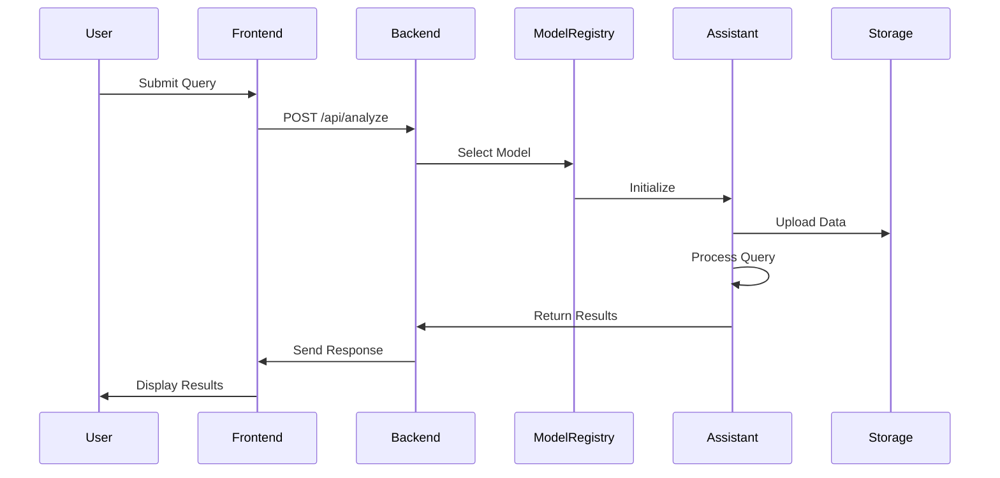

# F1 Analysis System Design

## System Architecture

### Overview
The F1 Analysis System is built on a modern, scalable architecture that combines real-time data processing with advanced AI analysis capabilities. The system uses a microservices-based approach with the following key components:

```
┌─────────────────┐     ┌─────────────────┐     ┌─────────────────┐
│   Frontend      │     │    Backend      │     │  Model Layer    │
│  (Next.js)      │────▶│   (FastAPI)     │────▶│  (OpenAI/Custom)│
└─────────────────┘     └─────────────────┘     └─────────────────┘
                               │                         │
                               ▼                         ▼
                        ┌─────────────────┐     ┌─────────────────┐
                        │   Database      │     │   File Storage  │
                        │   (SQLite)      │     │   (Local/S3)    │
                        └─────────────────┘     └─────────────────┘
```

### Components

1. **Frontend Layer**
   - Next.js application
   - React components for visualization
   - Real-time data updates
   - Interactive query interface

2. **Backend Layer**
   - FastAPI server
   - Asynchronous request handling
   - Data processing pipeline
   - Model orchestration

3. **Model Layer**
   - GPT-4 Assistant integration
   - Custom model implementations
   - Model registry and selection
   - Result processing

4. **Storage Layer**
   - SQLite database for persistence
   - File storage for temporary data
   - Cache management
   - Resource cleanup

## System Workflow

### 1. Query Processing Flow



### 2. Data Flow

```
1. Query Input → Validation → Preprocessing
2. Data Fetching → Transformation → Storage
3. Model Selection → Analysis → Result Generation
4. Response Formatting → Visualization → Presentation
```

## Key Components

### 1. Model Registry
```python
class ModelRegistry:
    def __init__(self):
        self.models: Dict[str, BaseModel] = {}
        self.default_model: str = "gpt4"

    async def get_model(self, query_type: str) -> BaseModel:
        return self.models.get(query_type, self.models[self.default_model])
```

### 2. GPT-4 Assistant
```python
class GPT4Assistant(BaseAssistantModel):
    def __init__(self, api_key: str, model: str = "gpt-4"):
        self.client = AsyncOpenAI(api_key=api_key)
        self.model = model
        self.assistant: Optional[Any] = None
        self.thread: Optional[Any] = None
```

### 3. Event Handler
```python
class F1AnalysisEventHandler(AsyncAssistantEventHandler):
    def __init__(self):
        super().__init__()
        self.analysis_text = ""
        self.image_files: List[str] = []
```

## API Endpoints

### 1. Analysis Endpoints

#### Query Analysis
```
POST /api/analyze
Content-Type: application/json

{
    "query": string,
    "data": {
        "type": "race" | "qualifying" | "season",
        "parameters": object
    }
}
```

#### Batch Analysis
```
POST /api/analyze/batch
Content-Type: application/json

{
    "queries": [
        {
            "query": string,
            "data": object
        }
    ]
}
```

### 2. Data Management

#### Data Upload
```
POST /api/data/upload
Content-Type: multipart/form-data

{
    "file": binary,
    "type": string,
    "metadata": object
}
```

#### Data Fetch
```
GET /api/data/{type}/{id}
Authorization: Bearer {token}
```

## Environment Variables

```bash
# OpenAI Configuration
OPENAI_API_KEY=sk-...
OPENAI_MODEL=gpt-4

# API Configuration
API_HOST=0.0.0.0
API_PORT=8000
API_DEBUG=false

# Database Configuration
DATABASE_URL=sqlite:///./f1_analysis.db

# Storage Configuration
STORAGE_TYPE=local
STORAGE_PATH=./data
```

## Security Considerations

1. **API Security**
   - JWT authentication
   - Rate limiting
   - Input validation
   - Error handling

2. **Data Security**
   - Encryption at rest
   - Secure file handling
   - Temporary file cleanup
   - Access control

3. **Model Security**
   - API key management
   - Request validation
   - Response sanitization
   - Resource limits

## Error Handling

1. **Error Types**
```python
class AnalysisError(Exception):
    pass

class ModelError(Exception):
    pass

class DataError(Exception):
    pass
```

2. **Error Responses**
```json
{
    "error": {
        "code": string,
        "message": string,
        "details": object
    }
}
```

## Performance Considerations

1. **Caching Strategy**
   - Query results caching
   - Data caching
   - Model response caching
   - File caching

2. **Resource Management**
   - Connection pooling
   - Thread management
   - Memory management
   - File cleanup

3. **Optimization**
   - Request batching
   - Async processing
   - Load balancing
   - Resource limits

## Monitoring and Metrics

1. **System Metrics**
   - Request latency
   - Error rates
   - Resource usage
   - Cache hit rates

2. **Model Metrics**
   - Processing time
   - Success rates
   - Token usage
   - Cost tracking

3. **User Metrics**
   - Query patterns
   - Usage statistics
   - Error patterns
   - User satisfaction

## Future Enhancements

1. **Scalability**
   - Distributed processing
   - Load balancing
   - Horizontal scaling
   - Cache distribution

2. **Features**
   - Real-time analysis
   - Advanced visualizations
   - Custom models
   - Batch processing

3. **Integration**
   - Additional data sources
   - External services
   - Custom plugins
   - API extensions 